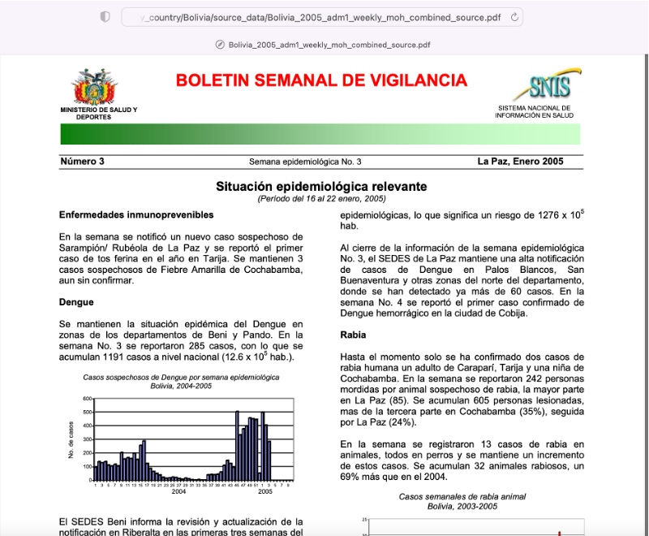
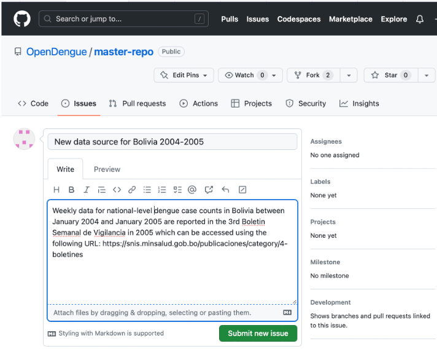
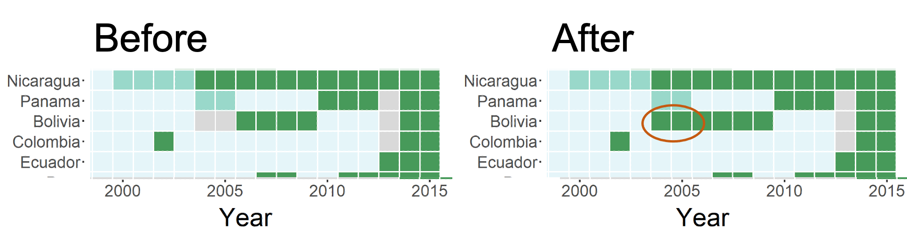

### Step 1: Finding an appropriate source
<br>

<br>
<br>
Take a look at the visual summaries of our [data coverage](https://opendengue.github.io/master-repo/index.html) and if you are aware of a data source for a country or time period that we have not included please get in touch. The data source must be publicly accessible (e.g. on a ministry of health website) and denominator based (e.g. 10 cases from a defined population over a defined period of time) but can be in any format (graph, table, etc) and any language. Please see our [Methods](https://opendengue.github.io/master-repo/overview.html) page for further details on the types of data we can and cannot include.

### Step 2: Raise a new issue on the [OpenDengue Github page](https://github.com/OpenDengue/master-repo/issues)
<br>

<br>
Adding new data by raising a Github issue  improves transparency of the data gathering process and allows us to easily track progress in filling data gaps. Please include a web link to the original data source and a brief description of the area and time period of the data gap to be filled.

If you are unsure how to raise a Github issue take a look at [this guide](https://docs.github.com/en/issues/tracking-your-work-with-issues/creating-an-issue#:~:text=On%20GitHub.com%2C%20navigate%20to,to%20open%2C%20click%20Get%20started.).

### Step 3: See the improvement
<br>

<br>
<br>
A member of the OpenDengue team will regularly review submissions and update the global database accordingly. When issues are closed you can expect to see new updates to the database. Tracking submissions by Github allows us to identify and credit all contributors for their efforts.

The above outlines our preferred process for contributing to OpenDengue, but if you would prefer to contact us directly, please do [get in touch](mailto:contribute@opendengue.org) via email.


```{r echo=FALSE}
library(metathis); library(dplyr)

meta() %>%
  meta_description(
    "The OpenDengue project aims to build and maintain a database of dengue case counts for every dengue-affected country worldwide since 1990. We collate data from a range of publicly available sources including ministry of health websites, peer-reviewed publications and other disease databases."
  ) %>% 
  
  meta_social(
    title = "OpenDengue: Contribute",
    url = "opendengue.org",
    image = "https://raw.githubusercontent.com/OpenDengue/master-repo/c679d73e51ad0b0fd3d1bfb66f5eaa6e52b26e1a/docs/logo/thumbnail.png",
    image_alt = "OpenDengue Logo",
    twitter_card_type = c("summary_large_image"),
    og_type = "website"

  )
```