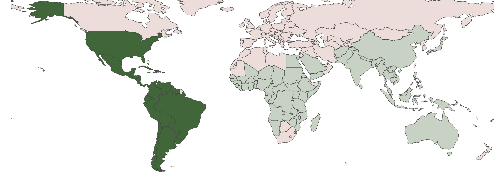

```{r include = FALSE, echo = FALSE, results = "hide"}
require(here); require(dplyr); require(stringr); require(lubridate); require(distill)
knitr::opts_knit$set(root.dir = here())
knitr::opts_chunk$set(echo = TRUE, warning = FALSE, message = FALSE, fig.path="./figure/")

pacman::p_load("dplyr", "lubridate",  "tidyr", "tidyverse",  "knitr", "stringi", "zoo", "data.table", "ggplot2", "sf", 'rnaturalearth', "sf", "rnaturalearthdata", "distill", "downloadthis")

```


## Access the data


```{r data download buttons1, echo=FALSE}
N_data <- read.csv(here("data/transformed_data/", "master_data.csv"))
SN_data <- read.csv(here("data/transformed_data/", "MOH_PAHO_SUB_transformed.csv"))

# National download button
N_data %>%
  download_this(
    output_name = "national dataset",
    output_extension = ".csv",
    button_label = "Download OpenDengue national data as csv",
    button_type = "info",
    has_icon = TRUE,
    icon = "fa fa-save",
    class = "button_large"
  )

# Sub-national download button
SN_data %>%
  download_this(
    output_name = "sub-national dataset",
    output_extension = ".csv",
    button_label = "Download OpenDengue sub-national data (select countries) as csv",
    button_type = "info",
    has_icon = TRUE,
    icon = "fa fa-save",
    class = "button_large"
  )
```

<br>
Suggested citation:

"The OpenDengue database, Version 1.0, 2023, https://opendengue.github.io/master-repo/, Accesssed [today's date]"

Please read our [Data](https://opendengue.github.io/master-repo/data.html) page for details, definitions and limitations.

## About OpenDengue
<br>

<br>
The OpenDengue project aims to build and maintain a database of dengue case counts for every dengue-affected country worldwide since 1990. We collate data from a range of publicly available sources including ministry of health websites, peer-reviewed publications and other disease databases. Learn more about the [project](https://opendengue.github.io/master-repo/project.html) or our [methods](https://opendengue.github.io/master-repo/overview.html).

In this first release (V1) we only include data from North America, South America and the Caribbean, but data from Asia (V2) and the rest of the world (V3) will be included over the coming months.

We are continually adding new data to the OpenDengue repository. If you are aware of publicly available data that we have not yet found, please [contribute](https://opendengue.github.io/master-repo/contribute.html) or [get in touch](https://opendengue.github.io/master-repo/contribute.html).


## Potential uses
OpenDengue draws together and standardises data from multiple sources that enable new analyses at global and regional scales. Examples include:  

- Identifying worst affected areas and years
- Understanding drivers of transmission such as climate factors and interventions
- Predicting future trends and outbreak risk

## Summary of data coverage

```{r load master data, include=FALSE}
data <- read.csv(here("data/transformed_data/", "master_data.csv"))
head(data)
plyr::count(data$source_cat)
plyr::count(data$adm_0_name)

data <- data %>%
  mutate(calendar_start_date = ymd(calendar_start_date), 
         calendar_end_date = ymd(calendar_end_date), 
         year = year(calendar_end_date), 
         diff = as.duration(interval(calendar_start_date, calendar_end_date))%/% as.duration(days(1)))%>%
  mutate(spatial_res = ifelse(adm_1_name %in% NA & adm_2_name %in% NA,  0, 
                       ifelse(adm_2_name %in% NA, 1, 2)))%>%
  mutate(temporal_res = ifelse(diff <8, 2, #weekly
                          ifelse(diff > 7 & diff < 31, 1, #monthly
                                                       0)))%>% #yearly
  #mutate(temporal_res = ifelse(grepl("all_PAHO", data$source_id, ignore.case = FALSE)== TRUE, "2", temporal_res))%>%
  select(adm_0_name:adm_2_code, spatial_res, temporal_res, year, diff,  calendar_start_date:source_cat)

plyr::count(data$diff)
plyr::count(data$spatial_res)
plyr::count(data$temporal_res)

data %>% 
  select(temporal_res, spatial_res, source_cat)%>% 
  group_by(temporal_res, spatial_res, source_cat)%>% tally()

# **** need to check temporal resolution for some of paho subnational data ****
data <- data %>%
  filter(!diff == 83)

plyr::count(data$source_cat)
bahamas <- data %>%
  filter(is.na(dengue_total))%>%
  filter(year>2013)%>%
  filter(source_cat %in% c("paho_adm0", "paho_imputed"))
```
<!--
Convert calendar dates back to epi weeks, to help with tallying the number of weeks at each temporal and spatial resolution.
-->
```{r epiweek, include=FALSE}
# Overwrite EW as month of the calendar_end_date if the temporal resolution is monthly
data <- data %>%
  mutate(EW = lubridate::week(calendar_end_date))%>%
  mutate(EW = ifelse(temporal_res==1, month(calendar_end_date), 
                ifelse(temporal_res==0, NA, EW)))

```
```{r country name, include=FALSE}
plyr::count(data$adm_0_name)

# Make country names consistent
lookup <- c("Antigua And Barbuda" = "Antigua and Barbuda",
         "Dominican republic" = "Dominican Republic",
         "Saint Kitts And Nevis" = "Saint Kitts and Nevis",
         "Saint Vincent And the Grenadines" = "Saint Vincent and the Grenadines",
         "Saint Vincent And The Grenadines" = "Saint Vincent and the Grenadines",
         "Trinidad And Tobago" = "Trinidad and Tobago", 
         "Turks And Caicos Islands" = "Turks and Caicos Islands", 
         "United States Of America" = "United States of America" 
         )


data <- data %>%
  mutate(adm_0_name = recode(adm_0_name, !!!lookup))

plyr::count(data$adm_0_name) #52 countries
```
```{r worldmap, echo=FALSE}

# load medium resolution global shapefile
world <- ne_countries(scale = "medium", returnclass = "sf")

# exclude antarctica from maps
world = world[world$continent != "Antarctica", ]

# 3 letter ISO codes for which we have data in the OpenDengue database
Incl_countries <- world$iso_a3[world$continent %in% c("North America", "South America")]
world$OD_status <- world$iso_a3 %in% Incl_countries

# numeric summaries of the data
# total countries we have any data for:
tot_any_data <- nrow(plyr::count(data$adm_0_name)) #52 countries
# that we have weekly or monthly counts for (any number of years)
tot_wkMn_data <- data %>%
  filter(!year < 1990)%>%
  group_by(adm_0_name,temporal_res)%>%
  tally()%>%
  filter(!temporal_res==0)%>%
  group_by(adm_0_name)%>% 
  tally() %>% nrow()
  
# that we have subnational data for (any number of years)
tot_subNational <- data %>%
  filter(!year < 1990)%>%
  group_by(adm_0_name,spatial_res)%>%
  tally()%>%
  filter(!spatial_res==0)%>%
  group_by(adm_0_name)%>% 
  tally() %>% nrow()

```

```{r heatmap order, include=FALSE}
# ordering country by longitude (?)
lookup_order <- read.csv(here("data/ref_data", "heatmap_order.csv"))
names(lookup_order)

#data_ctr <- data %>% select(adm_0_name) %>% distinct()
#data_ctr <- merge(data_ctr, lookup_order, by=c("adm_0_name"), all.x=T, all.y=T)

plyr::count(data$adm_0_name) #alphabetic order 

data$adm_0_name <- factor(data$adm_0_name, 
                          levels = unique(lookup_order$adm_0_name[order(lookup_order$desired_order)]))

plyr::count(data$adm_0_name) #desired order

```

<!--The opacity/gradient of the colour is determined by the proportion of the year at which that temporal resolution is available. -->

```{r check temp res, include=FALSE}
# first check if any country-year has data for more than one temporal resolution
data %>%
  mutate(temporal_res_nm = ifelse(temporal_res==2, "Weekly", 
                         ifelse(temporal_res==1, "Monthly", "Yearly")))%>%
  group_by(adm_0_name, year, temporal_res_nm)%>%
  tally()%>%
  mutate(n2 = ifelse(is.na(n)==FALSE, 1, NA))%>% select(-n)%>% 
  spread(., temporal_res_nm, n2)%>%
  mutate(total = Weekly+Monthly+Yearly) %>%
  arrange(desc(total)) #Data for Nicaragua (2004-2005) include different temporal resolutions 

```
<!--
No color gradient applied to each cell. It is possible, for example, to only have data for one month of a certain year available.
-->
```{r temp_boolean, include=FALSE}
temp_boolean <- data %>%
  group_by(adm_0_name, year, temporal_res)%>%
  tally()%>%
  arrange(adm_0_name, year, desc(temporal_res))%>%  
  group_by(adm_0_name, year) %>% slice_head(n=1)%>% select(-n)%>% ungroup()%>%
  complete(adm_0_name, year) %>%
  mutate(temporal_res_nm = ifelse(temporal_res==2, "Weekly", 
                            ifelse(temporal_res==1, "Monthly", "Yearly")))%>%
  mutate(temporal_res_nm = factor(temporal_res_nm, levels=c("Weekly", "Monthly", "Yearly")))

plyr::count(temp_boolean$adm_0_name)
```

```{r temp fig, fig.width = 18, fig.height = 18, echo=FALSE}
temp_boolean %>%
  filter(!year < 1990)%>%
  mutate(year = as.character(year))%>%
  
ggplot( aes(x=year, y=adm_0_name))+
  geom_tile(aes(fill=temporal_res_nm), 
            color = "white", lwd = 0.8, linetype = 1)+
  scale_y_discrete(limits=rev, expand=c(0,0))+
  scale_x_discrete(expand=c(0,0),
                   breaks=seq(1990, 2020, by=5)
                     )+
  scale_fill_manual(name = "Temporal resolution", 
                    values = c("#479A5A",  "#99D8CA", "#E5F5F9"), na.value="#D9D9D9")+
                             #"#6A3D9A", "#FFFF99", "#33A02C",   "#B15928","#A6CEE3"
  coord_fixed()+
  theme_bw()+
  ggtitle("Best temporal resolution available")+
  xlab("Year")+ylab("Country")+
  theme(plot.title = element_text(size=28), 
        axis.title.x = element_text(size=28, vjust=0),
        axis.title.y = element_text(size=28), 
        axis.text = element_text(size=18), 
        axis.ticks = element_line(size=1),
        legend.title = element_text(size=20),
        legend.text = element_text(size=18), 
        plot.margin = margin(t=-50, b=-50, l=20, r=20), 
        plot.background = element_blank(),
        panel.grid = element_blank(),
        panel.border = element_blank())

```

```{r check spatial res, include=FALSE}
# first check if any country-year has data for more than one spatial resolution
data %>%
  mutate(spatial_res_nm = ifelse(spatial_res==2, "adm2", 
                         ifelse(spatial_res==1, "adm1", "adm0")))%>%
  group_by(adm_0_name, year, spatial_res_nm)%>%
  tally()%>%
  mutate(n2 = ifelse(is.na(n)==FALSE, 1, NA))%>% select(-n)%>% 
  spread(., spatial_res_nm, n2)%>%
  mutate(total = adm2+adm1+adm0) %>%
  arrange(desc(total)) #Data for Brazil (2001-2005) include different spatial resolutions 

```
<!--No color gradient applied to each cell. It is possible, for example, to only have data for one adm2 area of a certain country available. -->

```{r spat boolean, include=FALSE}
spat_boolean <- data %>%
  group_by(adm_0_name, year, spatial_res)%>%
  tally()%>%
  arrange(adm_0_name, year, desc(spatial_res))%>%  
  group_by(adm_0_name, year) %>% slice_head(n=1)%>% select(-n)%>% ungroup()%>%
  complete(adm_0_name, year) %>%
  mutate(spatial_res_nm = ifelse(spatial_res==2, "adm2", 
                         ifelse(spatial_res==1, "adm1", "adm0")))%>%
  mutate(spatial_res_nm = factor(spatial_res_nm, levels=c("adm2", "adm1", "adm0")))
```

```{r spat fig, fig.width = 18, fig.height = 18, echo=FALSE}
spat_boolean %>%
  filter(!year < 1990)%>%
  mutate(year = as.character(year))%>%
ggplot( aes(x=year, y=adm_0_name, group=spatial_res_nm))+
  geom_tile(aes(fill=spatial_res_nm), 
            color = "white",  lwd = 0.8, linetype = 1)+
  scale_y_discrete(limits=rev, expand=c(0,0))+
  scale_x_discrete(  breaks = seq(1990,2020, by=5), 
                     expand=c(0,0))+
  scale_fill_manual(name = "Spatial resolution", 
                    values = c("#c51b8a", "#fa9fb5","#fde0dd"), na.value="#D9D9D9")+
  coord_fixed()+
  theme_bw()+
  ggtitle("Best spatial resolution available")+
  xlab("Year")+ylab("Country")+
  theme(plot.title = element_text(size=28), 
        axis.title.x = element_text(size=28, vjust=0),
        axis.title.y = element_text(size=28), 
        axis.text = element_text(size=18), 
        axis.ticks = element_line(size=1),
        legend.title = element_text(size=20),
        legend.text = element_text(size=18), 
        plot.margin = margin(t=20, b=20, l=20, r=20), 
        plot.background=element_blank(),
        panel.border=element_blank())
```

Our goal at the OpenDengue project is to fill as many of these gaps as we can. If you know of any publicly available data sources for any of the grey or light coloured countries or years in the above figures please [contribute](https://opendengue.github.io/master-repo/contribute.html) or [get in touch](https://opendengue.github.io/master-repo/contribute.html).