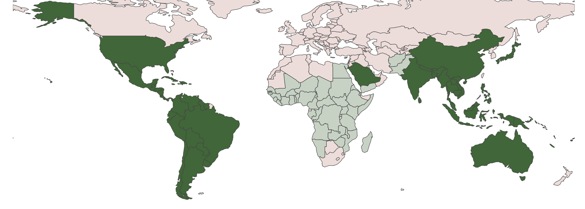
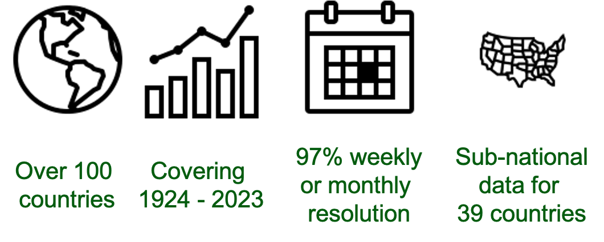

```{r include = FALSE, echo = FALSE, results = "hide"}
require(here); require(dplyr); require(stringr); require(lubridate); require(distill)
knitr::opts_knit$set(root.dir = here())
knitr::opts_chunk$set(echo = TRUE, warning = FALSE, message = FALSE, fig.path="./figure/")

pacman::p_load("dplyr", "lubridate",  "tidyr", "tidyverse",  "knitr", "stringi", "zoo", "data.table", "ggplot2", "sf", 'rnaturalearth', "sf", "rnaturalearthdata", "distill", "downloadthis", "metathis")

```


## Access the data

Please visit our [Data](https://opendengue.github.io/master-repo/data.html) page for download options, database details, definitions and limitations.

Suggested citation:

"The OpenDengue database, Version 1.0, 2023, https://opendengue.org/, Accesssed [today's date]"


## About OpenDengue


<br>
The OpenDengue project aims to build and maintain a database of dengue case counts for every dengue-affected country worldwide since 1990. We collate data from a range of publicly available sources including ministry of health websites, peer-reviewed publications and other disease databases. Learn more about the [project](https://opendengue.org/project.html) or our [methods](https://opendengue.org/overview.html).

The database will continue to be developed over the coming years in different versions. The current release (Version 1) will focus on collating dengue case data for as many countries and years as possible. Version 2 will aim to maximise the spatial and temporal resolution of the data and Version 3 will add disaggregate dengue case counts by severity, method of confirmation, age and serotype where such data are available.

We are continually adding new data to the OpenDengue repository. If you are aware of publicly available data that we have not yet found, please [contribute](https://opendengue.org/contribute.html) or [get in touch](mailto:contribute@opendengue.org).




## Potential uses
OpenDengue draws together and standardises data from multiple sources that enable new analyses at global and regional scales. Examples include:  

- Identifying worst affected areas and years
- Understanding drivers of transmission such as climate factors and interventions
- Predicting future trends and outbreak risk

## Summary of data coverage


<a href="./figure/heatmap_temporal_.html" target="_blank">
    </a>

<a href="./figure/heatmap_spatial_.html" target="_blank">
    </a>


Our goal at the OpenDengue project is to fill as many of these gaps as we can. If you know of any publicly available data sources for any of the grey or light coloured countries or years in the above figures please [contribute](https://opendengue.github.io/master-repo/contribute.html) or [get in touch](mailto:contribute@opendengue.org).


```{r echo=FALSE}

meta() %>%
  meta_description(
    "The OpenDengue project aims to build and maintain a database of dengue case counts for every dengue-affected country worldwide since 1990. We collate data from a range of publicly available sources including ministry of health websites, peer-reviewed publications and other disease databases."
  ) %>% 
  
  meta_social(
    title = "OpenDengue",
    url = "opendengue.org",
    image = "https://github.com/OpenDengue/master-repo/docs/logo/thumbnail.png",
    image_alt = "OpenDengue Logo",
    og_type = "website",

  )
```

