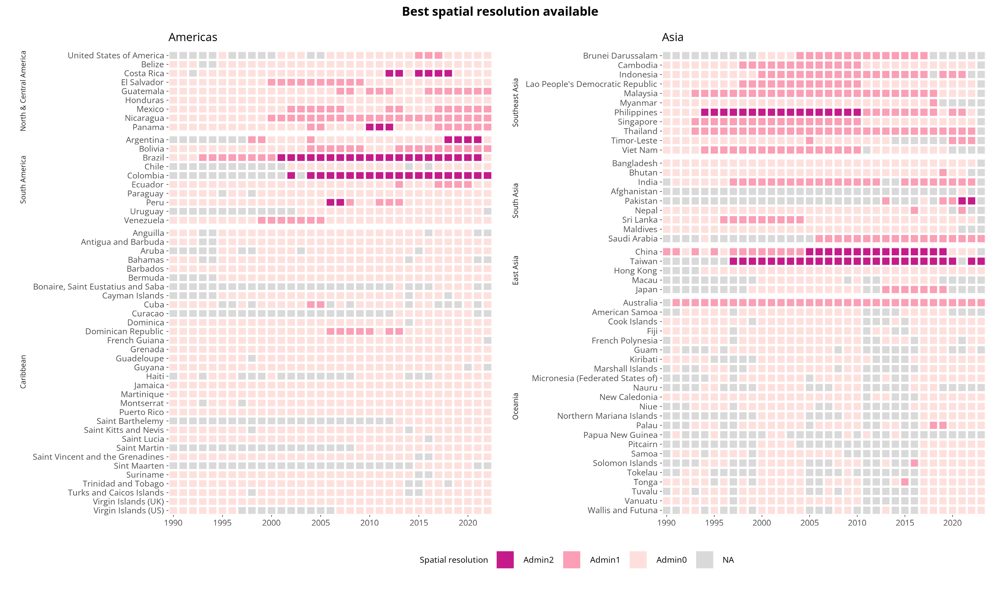

```{r include = FALSE, echo = FALSE, results = "hide"}
require(here); require(dplyr); require(stringr); require(lubridate); require(distill)
knitr::opts_knit$set(root.dir = here())
knitr::opts_chunk$set(echo = TRUE, warning = FALSE, message = FALSE, fig.path="./figure/")

pacman::p_load("dplyr", "lubridate",  "tidyr", "tidyverse",  "knitr", "stringi", "zoo", "data.table", "ggplot2", "sf", 'rnaturalearth', "sf", "rnaturalearthdata", "distill", "downloadthis")

```


## Access the data

```{r data download buttons1, echo=FALSE}
N_data <- read.csv(here("data/raw_data/", "master_data.csv"))
# SN_data <- read.csv(here("data/raw_data/", "MOH_PAHO_SUB_transformed.csv"))

# National download button
N_data %>%
  download_this(
    output_name = "national dataset",
    output_extension = ".csv",
    button_label = "Download OpenDengue national data as csv",
    button_type = "info",
    has_icon = TRUE,
    icon = "fa fa-save fa-1x",
    class = "button_large"
  )

# Sub-national download button
# SN_data %>%
#   download_this(
#     output_name = "sub-national dataset",
#     output_extension = ".csv",
#     button_label = "Download OpenDengue sub-national data (select countries) as csv",
#     button_type = "info",
#     has_icon = TRUE,
#     icon = "fa fa-save fa-1x",
#     class = "button_large"
#   )
```

<br>
Suggested citation:

"The OpenDengue database, Version 1.0, 2023, https://opendengue.org/, Accesssed [today's date]"

Please read our [Data](https://opendengue.github.io/master-repo/data.html) page for details, definitions and limitations.

## About OpenDengue
<br>

<br>
The OpenDengue project aims to build and maintain a database of dengue case counts for every dengue-affected country worldwide since 1990. We collate data from a range of publicly available sources including ministry of health websites, peer-reviewed publications and other disease databases. Learn more about the [project](https://opendengue.github.io/master-repo/project.html) or our [methods](https://opendengue.github.io/master-repo/overview.html).

In this first release (V1) we only include data from North America, South America and the Caribbean, but data from Asia (V2) and the rest of the world (V3) will be included over the coming months.

We are continually adding new data to the OpenDengue repository. If you are aware of publicly available data that we have not yet found, please [contribute](https://opendengue.org/contribute.html) or [get in touch](mailto:contribute@opendengue.org).


## Potential uses
OpenDengue draws together and standardises data from multiple sources that enable new analyses at global and regional scales. Examples include:  

- Identifying worst affected areas and years
- Understanding drivers of transmission such as climate factors and interventions
- Predicting future trends and outbreak risk

## Summary of data coverage

<a href="./figure/heatmap_temporal_.html" target="_blank">
    </a>


<a href="./figure/heatmap_spatial_.html" target="_blank">
    </a>


Our goal at the OpenDengue project is to fill as many of these gaps as we can. If you know of any publicly available data sources for any of the grey or light coloured countries or years in the above figures please [contribute](https://opendengue.github.io/master-repo/contribute.html) or [get in touch](mailto:contribute@opendengue.org).