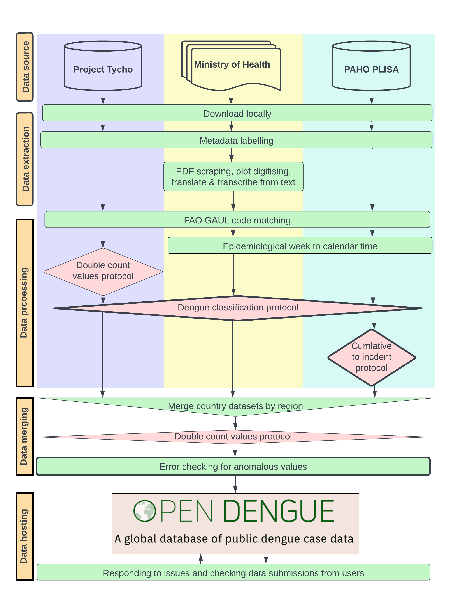
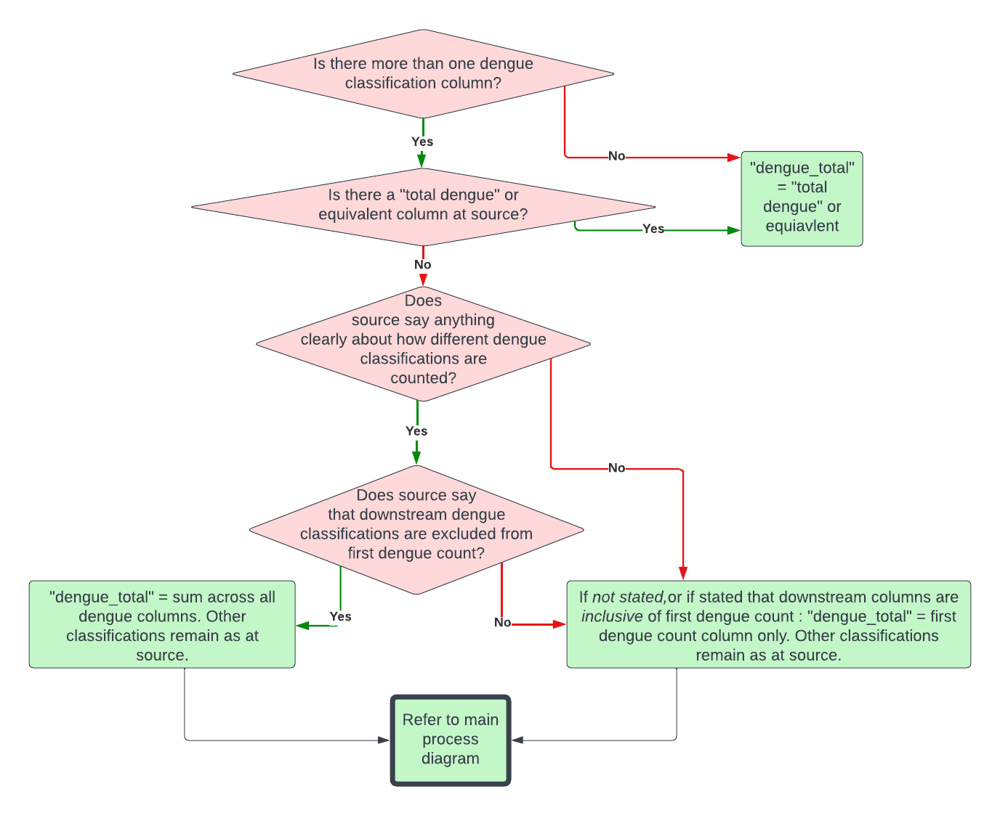
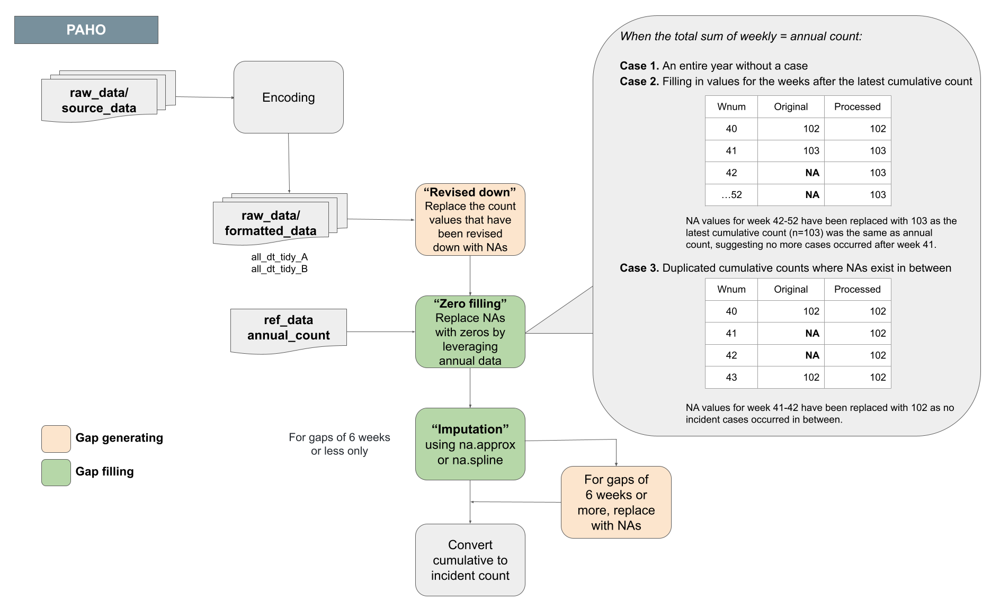
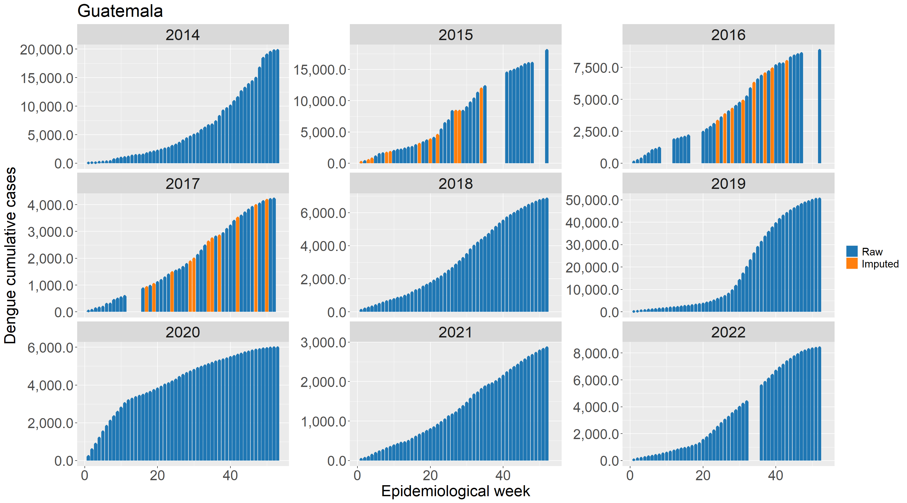
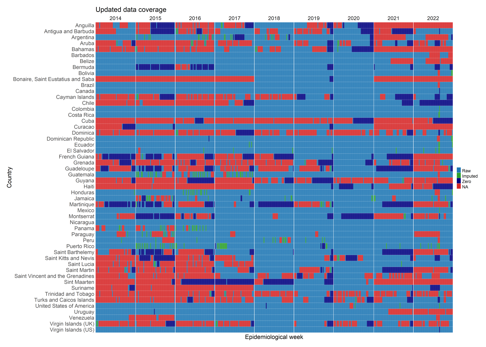
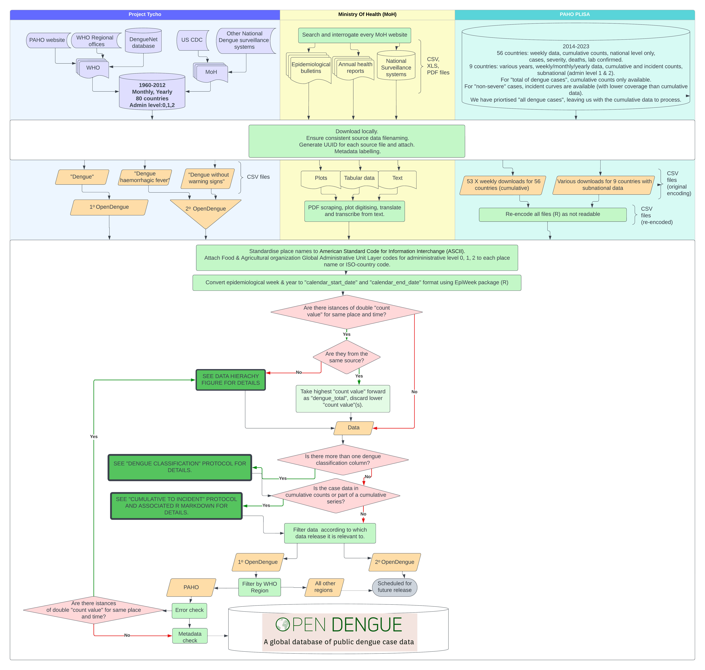

## Overview
OpenDengue combines data from a variety of existing databases, ministry of health reports and other sources and conducts a series of extraction, geopositioning, standardisation and error checking protocols. Each step of our analysis is accompanied by detailed sourcedata to ensure case counts can be tracked back to their original reporting source. A summary and detailed workflow diagram are presented below with more detail on specific sub-protocols. An accompanying manuscript detailing all protocols, imputation performance checking and data summaries is under preparation.

## Summary work flow
```{r, echo=FALSE}




```

### Double count values sub-protocol
Sometimes multiple different sources will report different case counts for the same location and time period. Where this occurred sources were prioritised in the following order (highest priority to lowest): Ministry of Health report / Regional health body report / other sources.

### Dengue classification sub-protocol
Some sources dissaggregate dengue cases by severity or other attributes that may or may not be mutually exclusive, making the total number of dengue cases reported unclear. We therefore use the following protocol to systematically measure total cases under these circumstances.

```{r, echo=FALSE}


```

### Cumulative cases to incident cases sub-protocol
Some data sources, in particular the Pan American Health Organization, report case counts as cumulative values since the beginning of the calendar year. Converting cumulative counts to incident counts can be difficult when there are gaps in the middle or end of the time series.

For gaps at the end of the time series, missing weeks' values were imputed with the value 0 if alternative sources confirmed that the annual total cases matched the final reported cumulative case count. For short (6 weeks of less) gaps in the middle of the time series we use spline-based imputation to estimate the distribution of values over missing weeks. For gaps longer than 6 weeks all values are assigned missing values (NA).

```{r, echo=FALSE}

```

An example application of this protocol for Guatemala:

```{r, echo=FALSE}

```
Summary of imputation across the PAHO dataset:

```{r, echo=FALSE}

```

### Error checking sub-protocol
We use the `anomalize` R package to detect anomalous values after de-trending the data. All identified anomalies were manually checked for extraction errors.

## Detailed protocol
```{r, echo=FALSE}


```


```{r echo=FALSE}
library(metathis); library(dplyr)
meta() %>%
  meta_description(
    "The OpenDengue project aims to build and maintain a database of dengue case counts for every dengue-affected country worldwide since 1990 or earlier. We collate data from a range of publicly available sources including ministry of health websites, peer-reviewed publications and other disease databases."
  ) %>% 
  
  meta_social(
    title = "OpenDengue: Data",
    url = "opendengue.org",
    image = "https://raw.githubusercontent.com/OpenDengue/master-repo/main/docs/logo/thumbnail.png",
    twitter_card_type = "summary_large_image",
    twitter_creator = "@OliverBrady1",
    image_alt = "OpenDengue Logo",
    og_type = "website"

  )
```