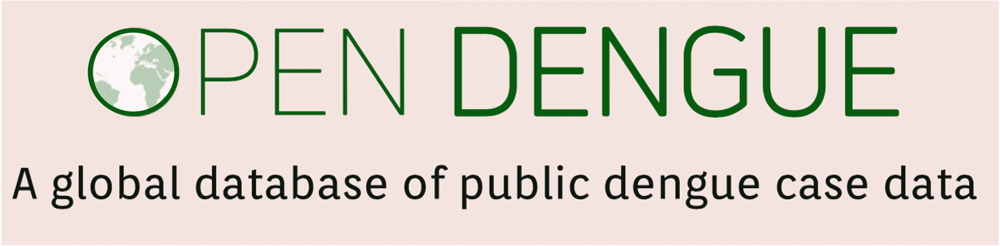

OpenDengue is a project run by researchers at the London School of Hygiene and Tropical Medicine that aims to address a key gap health data analytics for dengue.

## Our goal
To build and maintain a freely available globally comprehensive database of historical and current dengue case data at the highest spatial and temporal resolution possible. 


## The challenge 
While many countries regularly publish dengue case statistics, they can often be difficult to find and no single database aggregates data from multiple countries to assess trends at the global level. While important progress has been made with platforms like [project TYCHO](https://www.tycho.pitt.edu) and the [PAHO PLISA system](https://www3.paho.org/data/index.php/en/mnu-topics/indicadores-dengue-en.html), such databases only cover specific countries or do not include the historical data that is so important for understanding long term trends. Locating, extracting, processing and standardising data all takes time but is essential to enable re-use and re-analysis


## How you can help
We are continually adding new data to the OpenDengue repository. If you are aware of publicly available data that we have not yet found, please [contribute](https://opendengue.github.io/master-repo/contribute.html) or [get in touch](mailto:contribute@opendengue.org).


## Team
OpenDengue is run the Dengue Mapping and Modelling Group at LSHTM. We are a group of 
modellers, epidemiologists and public health practitioners who use data to give new insights 
into the burden, spread and containment of mosquito-transmitted diseases. We are part of the [Centre for Mathematical Modelling of Infectious Diseases](https://www.lshtm.ac.uk/research/centres/centre-mathematical-modelling-infectious-diseases). 

Key individuals include:

* Dr Joe Clarke (data acquisition)
* [Dr Ah-young Lim](https://www.lshtm.ac.uk/aboutus/people/lim.ahyoung) (data processing and modelling)
* [Associate Professor Oliver Brady](https://www.lshtm.ac.uk/aboutus/people/brady.oliver) (director)


## Funders
The OpenDengue project is supported by a research grant from the UK Medical Research Council UK Medical Research Council (Grant number: [MR/V031112/1](https://gtr.ukri.org/projects?ref=MR%2FV031112%2F1)).


```{r echo=FALSE}
library(metathis)

meta() %>%
  meta_description(
    "The OpenDengue project aims to build and maintain a database of dengue case counts for every dengue-affected country worldwide since 1990 or earlier. We collate data from a range of publicly available sources including ministry of health websites, peer-reviewed publications and other disease databases."
  ) %>% 
  
  meta_social(
    title = "OpenDengue: Data",
    url = "opendengue.org",
    image = "https://raw.githubusercontent.com/OpenDengue/master-repo/main/docs/logo/thumbnail.png",
    twitter_card_type = "summary_large_image",
    twitter_creator = "@OliverBrady1",
    image_alt = "OpenDengue Logo",
    og_type = "website"

  )
```
